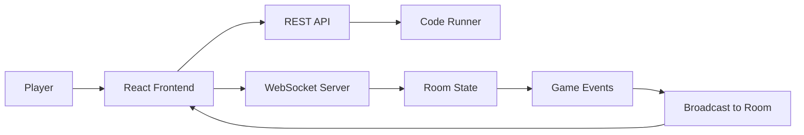
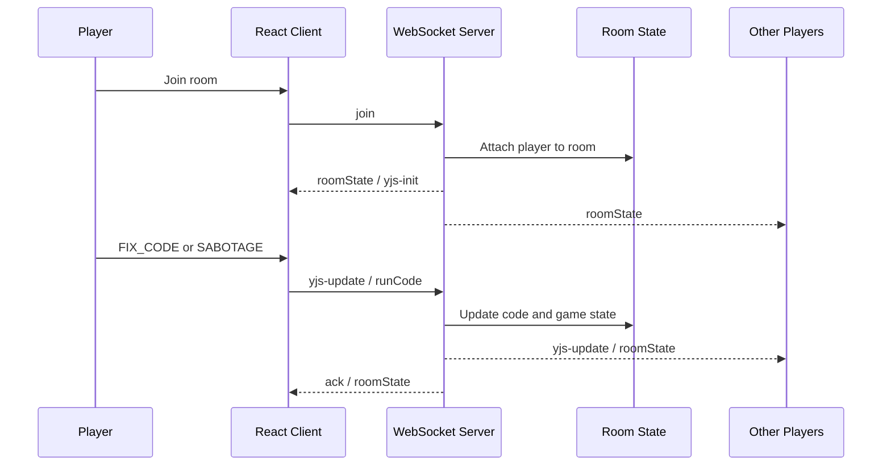

# BeGamer

BeGamer is a real-time multiplayer coding game where players join a room, collaborate on a shared codebase, and try to identify the imposter before the round ends.

## Tech Stack

- Frontend: React, Vite, Monaco Editor
- Realtime: WebSockets, Yjs
- Backend: Node.js, Express
- Data and auth: Firebase Realtime Database, Firebase Auth
- Code execution: Docker-based runners for JavaScript, Python, and C++

## Core Concept

The game borrows the social deduction loop from *Among Us* and applies it to a coding session.

- Developers work together to fix or complete the given code challenge.
- The imposter looks like a normal player but tries to introduce subtle sabotage.
- Everyone shares the same room state, editor session, voting flow, and result screen in real time.

Typical round flow:

1. Players create or join a room.
2. The host starts topic voting.
3. A challenge is loaded into the shared editor.
4. Players edit code together during the round.
5. The server runs the submitted code and evaluates the result.
6. Players either win the round or move into a meeting and voting phase.

## High-Level Architecture

The project is split into three main parts:

- The React frontend handles room screens, the shared editor, voting, role reveal, and results.
- The Express backend exposes REST endpoints for code execution and hosts the WebSocket server.
- The WebSocket layer manages room membership, shared editor updates, game state transitions, chat, cursor sync, and room broadcasts.

Firebase is used for authentication and challenge/snippet data. Yjs is used to keep the shared editor state consistent across connected players.

## Application Flow



The REST side is used for code execution, while the WebSocket side keeps the room state live. Both paths meet at the room state model that the frontend renders.

## WebSocket Event Flow



In practice, editor sync happens through events like `yjs-update` and `updateCursor`, while room progression uses events such as `createroom`, `join`, `startVoting`, `vote`, `runCode`, and `finalizeMeeting`.

## Project Structure

```text
begameer/
|-- Backend/
|   |-- index.js                # Express server and /run-code API
|   |-- websocket/              # WebSocket server, handlers, services
|   |-- Roomactions/            # Game rules, room actions, execution flow
|   |-- docker/                 # Language runner images
|   `-- roomsStore.js           # In-memory room and Yjs document store
|-- frontend/
|   |-- src/
|   |   |-- Main/               # Room screens and room lifecycle hooks
|   |   |-- components/         # Editor, voting, loader, pages
|   |   `-- context/            # Socket, Firebase, room actions
|   `-- package.json
|-- PERFORMANCE_RELIABILITY_REVIEW.md
`-- README.md
```

## How to Run

### 1. Install dependencies

```bash
cd Backend
npm install

cd ../frontend
npm install
```

### 2. Configure environment variables

Create a `.env` file for the backend using `Backend/sample.env` as a reference.

Required values:

- `PORT=5001`
- Firebase config values used by the project
- Optional frontend socket override: `VITE_WS_URL`

The frontend also expects the Firebase `VITE_*` variables at build time.

### 3. Make sure Docker is available

Code execution is sandboxed through Docker containers. The backend will fail to run submitted code if Docker is not installed or not accessible.

### 4. Start the backend

```bash
cd Backend
npm run dev
```

The API and WebSocket server both run on `http://localhost:5001`.

### 5. Start the frontend

```bash
cd frontend
npm run dev
```

By default, the frontend runs on Vite's local dev server and connects to the backend over WebSockets.

## Notes for Developers

- Room state is currently stored in memory, so server restarts clear active rooms.
- Shared editor sync is handled with Yjs, not plain text replacement alone.
- `POST /run-code` is rate-limited and executes code inside Docker with output and timeout limits.
- WebSocket messages are routed by event type under `Backend/websocket/handlers`.
- If you add new gameplay events, update both the socket handlers and the frontend room actions together.
