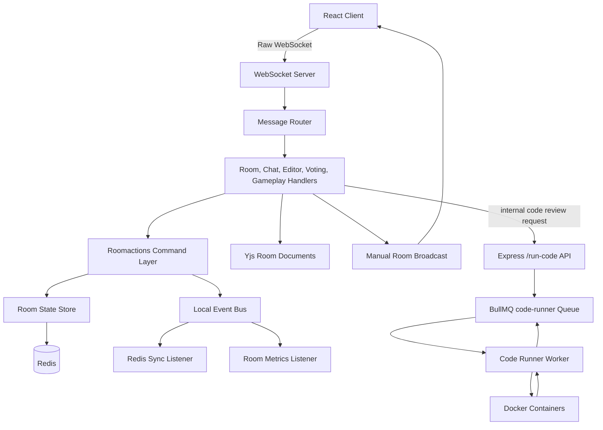
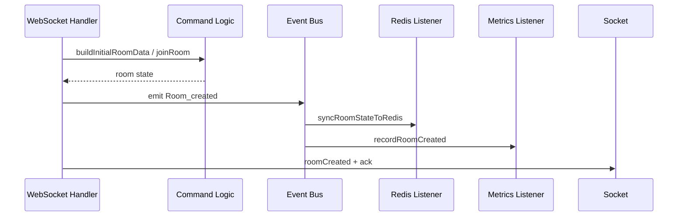
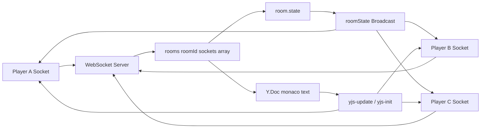
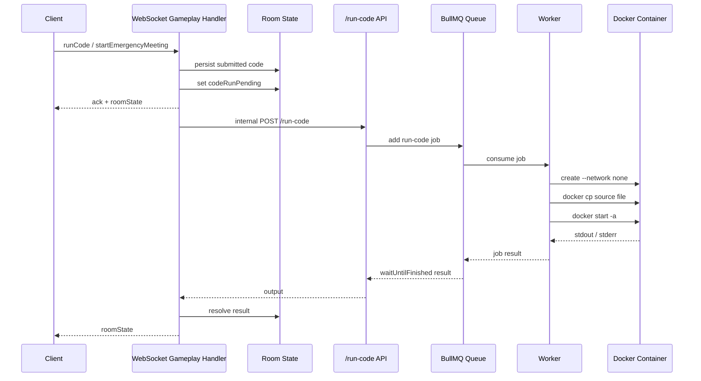

# BeGamer

BeGamer is a real-time multiplayer coding game: Among Us for coders. Players join a shared room, collaborate in a live code editor, and try to complete the crew objective while one imposter quietly pushes the code toward a sabotage output.

## Project Overview

The game combines social deduction with collaborative programming:

- Players create or join a WebSocket room.
- The host starts topic voting.
- A coding challenge is loaded into a shared Yjs editor.
- Crew players try to produce the expected output.
- The imposter tries to make the program produce the sabotage output.
- The backend executes the submitted code and resolves the round into a win, meeting, draw, or next round.

## How It Works

### Room Lifecycle

1. A client opens a raw WebSocket connection and receives a stable `userId`.
2. The host sends `createroom`.
3. The backend creates an in-memory room, attaches the host socket, initializes room state, and emits a `Room_created` event.
4. Event listeners persist the room to Redis and update room metrics.
5. Other players send `join` with a room id and username.
6. The backend restores the room from Redis if needed, attaches the socket, initializes Yjs state, and broadcasts the updated room state.
7. Empty rooms are deleted from memory and Redis after the last player leaves or disconnects past the reconnect grace window.

### Player Lifecycle

1. Each socket has a `userId`, either from the query string or a generated UUID.
2. Joining the room stores the player in `room.state.players`.
3. Existing players can reconnect and keep their identity.
4. Players joining during `playing` or `meeting` become spectators.
5. On socket close, the player is marked disconnected and a grace timer starts.
6. If the player reconnects before the timer expires, the pending disconnect is cleared.
7. If the timer expires, the player is removed, host ownership may transfer, and the game may resolve if an alive player or imposter left.

### Chat System

1. Clients send `sendChat`.
2. The backend validates room access and alive-player status.
3. Empty messages are rejected.
4. Chat is disabled while a code review is pending during gameplay.
5. Valid messages are stored in room metadata and Redis.
6. The full room state is broadcast to every socket in the room.

### Code Mutation and Fixing

1. Collaborative editor updates are sent as `yjs-update`.
2. The backend applies the Yjs update to the room's server-side `Y.Doc`.
3. The full code is persisted into room state.
4. The original update is forwarded to other sockets in the room.
5. Explicit `Updatecode` requests replace the stored code, rebuild the Yjs document, and broadcast a fresh Yjs snapshot.
6. Code edits are allowed only while the room is in `playing` and no code review is pending.

### Code Execution Using Docker Containers

The backend has two execution-related pieces:

- `Backend/worker/worker.js` is the active local BullMQ worker path.
- `docker-heater/*` documents the deployed preheated runner services and how those servers work in production. Production runner URLs are expected through environment configuration, so the reference services are not imported directly by the backend folder.

Active backend flow:

1. A gameplay action such as `runCode` or `startEmergencyMeeting` persists the current submitted code.
2. The room is marked `codeRunPending`.
3. The server starts an asynchronous code review.
4. `executeCodeAndResolve` posts the code to `/run-code`.
5. `/run-code` adds a BullMQ job to the `code-runner` queue.
6. The worker consumes the job and writes source code into a temporary workspace.
7. The worker creates an isolated Docker container with networking disabled.
8. The source file is copied into the container.
9. The container runs the language command for C++, JavaScript, or Python.
10. Output is returned through BullMQ.
11. The backend compares output against the crew and imposter expected outputs.
12. The room transitions to `crew_win`, `imposter_win`, or `meeting`.

## Architecture

BeGamer uses a hybrid architecture:

- Synchronous command functions own core game mutations.
- Event-driven listeners handle selected side effects.
- Redis stores shared room state and queue data.
- Raw WebSocket connections handle room communication.
- Docker-based runners isolate untrusted code execution.

Command-style functions live mostly in `Backend/Roomactions`. They validate state, mutate room objects, and persist snapshots to Redis.

The event bus is a local Node `EventEmitter`. It currently handles `Room_created` side effects such as Redis sync and metrics. Gameplay actions are intentionally direct command calls, not event-sourced workflows.

Redis stores room metadata, players, votes, meeting votes, user-room mappings, active room ids, room stats, and BullMQ queue data. It is persistence and coordination infrastructure; it is not currently used for WebSocket pub/sub fanout.

The WebSocket layer is manual. Each room owns an array of sockets, and broadcasts iterate over that array. This keeps the model simple and gives tight control over reconnect behavior, but it creates single-node assumptions for live rooms.

## Diagrams

### System Architecture

### Event Flow

### WebSocket Room Communication

### Code Execution Pipeline

## Tech Stack

- Node.js
- Express
- Raw WebSocket via `ws`
- Yjs for collaborative editor state
- Redis with `ioredis`
- BullMQ
- Docker containers for code execution
- React, Vite, and Monaco Editor on the frontend
- Firebase Realtime Database for challenge data when configured

## Engineering Highlights

- Real-time multiplayer rooms over raw WebSockets.
- Manual room/socket system with reconnect grace handling.
- Hybrid command and event-driven backend architecture.
- Redis-backed room recovery and state persistence.
- Yjs-powered collaborative code editing.
- Containerized execution for C++, JavaScript, and Python.
- Reference implementation for deployed preheated runner services under `docker-heater`.

## Why This Architecture?

The system favors explicit control over framework magic. Manual WebSocket rooms make it easy to reason about membership, host transfer, reconnects, room broadcasts, and game state transitions. Command-style game actions keep critical state changes direct and debuggable.

The event bus is used for side effects that do not need to block the main WebSocket response, such as room-created persistence and metrics. Redis provides shared persistence and queue infrastructure without forcing the live socket layer into a distributed design too early.

Docker-based execution isolates submitted code from the application process. The deployed preheated runner approach can reduce cold-start overhead, while the BullMQ worker path provides a queue-based execution model for local and containerized backend deployments.

Tradeoffs:

- Manual socket rooms are simple but single-node for live fanout.
- Redis snapshots are practical but require care around concurrent writes.
- Local `EventEmitter` events are lightweight but not durable.
- Docker isolation is stronger than in-process execution, but container security still needs strict resource controls.

## Future Improvements

- Add Redis Pub/Sub, Redis Streams, or a dedicated message broker for cross-node WebSocket fanout.
- Move high-risk room transitions into atomic Redis Lua scripts or versioned compare-and-set updates.
- Use a durable event system for gameplay events if the event-driven surface grows.
- Add stricter container limits for CPU, memory, process count, filesystem, and execution time.
- Route production code execution explicitly through preheated runner service URLs when that deployment model is active.
- Add structured logs, request ids, room ids, and job ids across WebSocket and worker flows.
- Add integration tests for room lifecycle, reconnects, duplicate joins, voting, meetings, and code execution.
- Add per-room backpressure and broadcast throttling for cursor/editor-heavy sessions.
